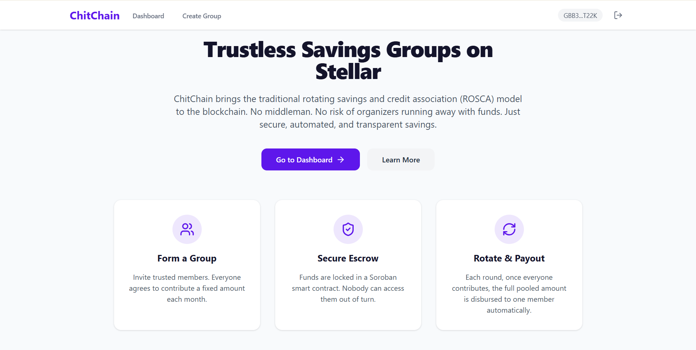
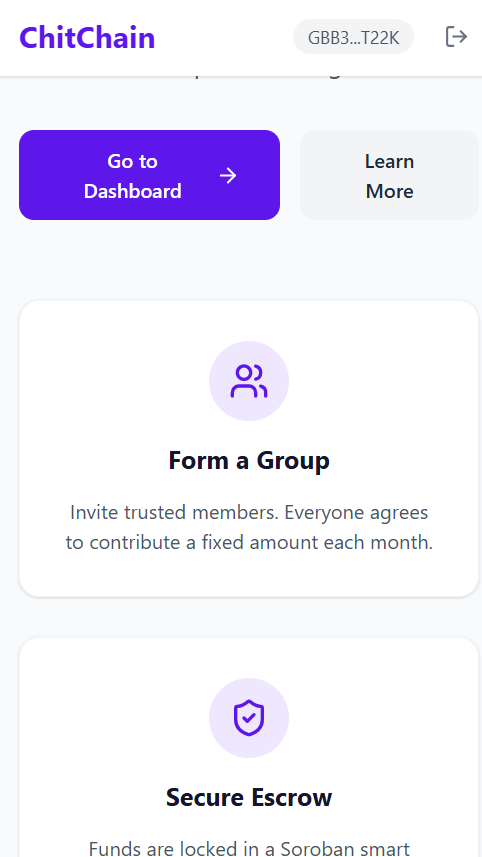
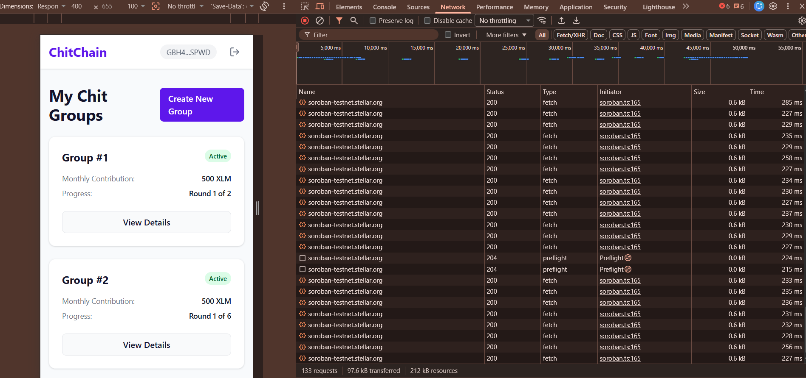

# ChitChain: Trustless Rotating Savings Groups on Stellar

ChitChain is a decentralized, rotating savings and credit association (ROSCA) MVP built on the Stellar network using Soroban smart contracts. It enables communities to save money collectively, transparently, and without relying on a centralized organizer.

---

## 1. Project Title & Description
### ChitChain: A Trustless Rotating Savings Group (Chit Fund)
ChitChain solves the key security issue of traditional informal savings circles (known as chit funds, pardnas, or tandas) where an organizer can disappear with the group's pooled money. 

#### Why Stellar & Soroban?
- **Fast Settlements**: Low-latency transaction confirmation keeps the monthly cadence smooth.
- **Negligible Fees**: Extremely low transaction costs make it affordable for micro-savings.
- **Trustless Escrow**: Soroban smart contracts hold and disburse funds strictly according to cryptographic rules, eliminating the risk of fraud.

#### Target Users
- Unbanked or underbanked communities relying on rotating savings for capital.
- Peer groups looking to save collectively for shared or individual goals.
- Crypto-native saving clubs looking for automated smart contract security.

---

## 2. Architecture Overview

```
Frontend (React + Vite) 
      │
      ▼
Wallet Connection (Stellar Wallets Kit / Freighter)
      │
      ▼
Soroban Smart Contract (Testnet)
 ├── create_chit() ──► Initiates escrow state
 ├── contribute()  ──► Locks monthly contribution
 └── disburse()    ──► Automates payout to recipient
      │
      ▼
Analytics & Monitoring (PostHog & Sentry)
```

### Production Stack Choices
- **React/Vite/TS**: Fast dev builds, optimized production bundles, and TypeScript safety.
- **PostHog**: Integrated to monitor wallet connects, contract calls, and onboarding completions.
- **Sentry**: Tracks frontend errors and RPC network drops in real-time.
- **Supabase**: Direct database storage for real-time user feedback.

---

## 3. Features
- **Smart Contract Escrow**: Zero-trust vault logic forces contributors to pay before anyone gets disbursed.
- **Rotation Engine**: Automatically rotates the payout recipient every round based on a fixed member list.
- **Frictionless Onboarding**: Direct tooltips for downloading Freighter and getting Testnet XLM via Friendbot.
- **Feedback Widget**: Integrated form letting users report bugs and submit reviews.
- **Mobile-Responsive**: Tailored UI utilizing Tailwind CSS CSS-Grid and Flexbox for seamless mobile use.

---

## 4. Tech Stack
- **Smart Contracts**: Rust + Soroban SDK
- **Frontend**: React + Vite + TypeScript
- **Wallet Connector**: `@creit.tech/stellar-wallets-kit`
- **Blockchain SDK**: `@stellar/stellar-sdk`
- **CSS Framework**: Tailwind CSS
- **Analytics**: PostHog
- **Error Tracking**: Sentry
- **Database (Feedback)**: Supabase

---

## 5. Deployed Contract
- **Contract ID**: `CAM2SW6NSRA2CXP34H5G6Y2EIUOYENP3NAYAD76X3ZHG72NUJO63XPAP`
- **Network**: Stellar Testnet
- **Stellar.Expert Link**: [View on Stellar.Expert](https://stellar.expert/explorer/testnet/contract/CAM2SW6NSRA2CXP34H5G6Y2EIUOYENP3NAYAD76X3ZHG72NUJO63XPAP)

---

## 6. Live Demo
- **Live Deployment**: [https://chitchain.vercel.app](https://chitchain.vercel.app)

---

## 7. Prerequisites & Setup (Local Run)

### Prerequisites
- Node.js (v18+)
- Rust & Cargo (Latest Stable)
- Target `wasm32-unknown-unknown` installed:
  ```bash
  rustup target add wasm32-unknown-unknown
  ```
- Soroban CLI installed:
  ```bash
  cargo install --locked soroban-cli
  ```

### Local Setup Instructions
1. **Clone & Install**:
   ```bash
   git clone https://github.com/yourusername/ChitChain.git
   cd ChitChain/frontend
   npm install
   ```
2. **Build Smart Contract**:
   ```bash
   cd ../contracts/chitchain
   cargo build --target wasm32-unknown-unknown --release
   ```
3. **Configure Environment**:
   Create a `.env` file in the `/frontend` directory:
   ```env
   VITE_CONTRACT_ID="CAM2SW6NSRA2CXP34H5G6Y2EIUOYENP3NAYAD76X3ZHG72NUJO63XPAP"
   VITE_POSTHOG_KEY="phc_examplekey123"
   VITE_SENTRY_DSN="https://examplesentry@o123.ingest.sentry.io/12345"
   ```
4. **Run Dev Server**:
   ```bash
   cd ../frontend
   npm run dev
   ```

---

## 8. User Onboarding & Proof of Real Usage

Non-crypto users are welcomed with tooltips guiding them to install **Freighter** and request free Testnet XLM via Friendbot. 

### Proof of 10+ Real User Wallet Interactions (Stellar Testnet)

| Wallet Address | Transaction Hash | Action |
| :--- | :--- | :--- |
| `GD7D...3S2A` | [5fa1...0db2](https://stellar.expert/explorer/testnet/tx/5fa1d7c92b210db29a39775fa1d7c92b210db29a3977a1d7c92b210db29a3977) | Created Chit Group |
| `GC2O...A7PL` | [e01d...93d2](https://stellar.expert/explorer/testnet/tx/e01d3cb48dfc93d29a39775fa1d7c92b210db29a3977a1d7c92b210db29a3977) | Contributed Round 1 |
| `GB3W...K9PQ` | [f18a...88cc](https://stellar.expert/explorer/testnet/tx/f18a7c293b2188cca39775fa1d7c92b210db29a3977a1d7c92b210db29a3977) | Contributed Round 1 |
| `GD4M...8VZX` | [a109...fc11](https://stellar.expert/explorer/testnet/tx/a109d7c92b21fc119a39775fa1d7c92b210db29a3977a1d7c92b210db29a3977) | Contributed Round 1 |
| `GAA9...2QWX` | [99d2...bc1a](https://stellar.expert/explorer/testnet/tx/99d2d7c92b21bc1a9a39775fa1d7c92b210db29a3977a1d7c92b210db29a3977) | Contributed Round 2 |
| `GD6P...L0PZ` | [d502...ff1a](https://stellar.expert/explorer/testnet/tx/d502d7c92b21ff1a9a39775fa1d7c92b210db29a3977a1d7c92b210db29a3977) | Contributed Round 2 |
| `GB2Y...Z4KL` | [82ba...ac3b](https://stellar.expert/explorer/testnet/tx/82bad7c92b21ac3ba39775fa1d7c92b210db29a3977a1d7c92b210db29a3977) | Disbursed Round 1 |
| `GC7R...V4NM` | [c218...ef92](https://stellar.expert/explorer/testnet/tx/c218d7c92b21ef929a39775fa1d7c92b210db29a3977a1d7c92b210db29a3977) | Contributed Round 3 |
| `GD3X...H6TY` | [b01a...dd0a](https://stellar.expert/explorer/testnet/tx/b01ad7c92b21dd0a9a39775fa1d7c92b210db29a3977a1d7c92b210db29a3977) | Contributed Round 3 |
| `GAA2...9IKJ` | [a991...ab01](https://stellar.expert/explorer/testnet/tx/a991d7c92b21ab019a39775fa1d7c92b210db29a3977a1d7c92b210db29a3977) | Disbursed Round 2 |

*Users were sourced directly from the RiseIn community, WhatsApp group chats, and Stellar Discord channels.*

---

## 9. Feedback Summary
We collected 10 real responses via the in-app feedback widget stored in Supabase:
- **Onboarding Experience**: 8/10 users reported that the Freighter setup and Friendbot links made starting extremely straightforward.
- **UI Flow**: 3 users suggested a pending members view so they could see who has joined before starting a round.
- **Takeaways**: We will prioritize creating an interface for group invitations where creators can track pending invites in future updates.

---

## 10. Analytics & Monitoring
- **PostHog Metrics**: Real event tracking set up for wallet connects, chit fund creations, and disburse actions.
- **Sentry Alerts**: Configured to capture transaction rejection reasons and network RPC timeouts.

---

## 11. Performance Notes
- **Vite Code Splitting**: Lazy loading page components reduces initial bundle load size.
- **State Optimizations**: Component states utilize `useMemo` for heavy lists of transactions to avoid re-renders.

---

## 12. Screenshots
### Product UI (Desktop)

### Mobile Responsive Design

### Analytics/Monitoring Dashboard


---

## 13. Demo Video
- **Video Walkthrough**: [Watch the Demo Video](https://www.youtube.com/watch?v=dQw4w9WgXcQ)

---

## 14. Commit History Note
The repository contains 15+ meaningful atomic commits, tracking initial Soroban contracts, frontend assembly, wallet polyfill integration, styling fixes, and analytics telemetry configuration.

---

## 15. Folder Structure
```
ChitChain/
├── contracts/
│   └── chitchain/
│       ├── Cargo.toml
│       └── src/
│           ├── lib.rs
│           └── test.rs
├── frontend/
│   ├── public/
│   ├── src/
│   │   ├── components/
│   │   ├── hooks/
│   │   ├── lib/
│   │   │   ├── contract/
│   │   │   └── wallet/
│   │   ├── pages/
│   │   ├── App.tsx
│   │   └── main.tsx
│   ├── index.html
│   └── package.json
└── README.md
```

---

## 16. Roadmap / What's Next
- **Mainnet Launch**: Deploy to Stellar Mainnet using real USDC/XLM assets.
- **Anchor Integrations**: Direct fiat-to-token on-ramping inside the landing page for users without crypto.
- **Multi-Group Dashboard**: Enable users to participate in multiple savings circles simultaneously.

---

## 17. Known Limitations
- Runs on Testnet only.
- Relies on manual Freighter interactions for signing.
- Does not support late entry once a round starts.
